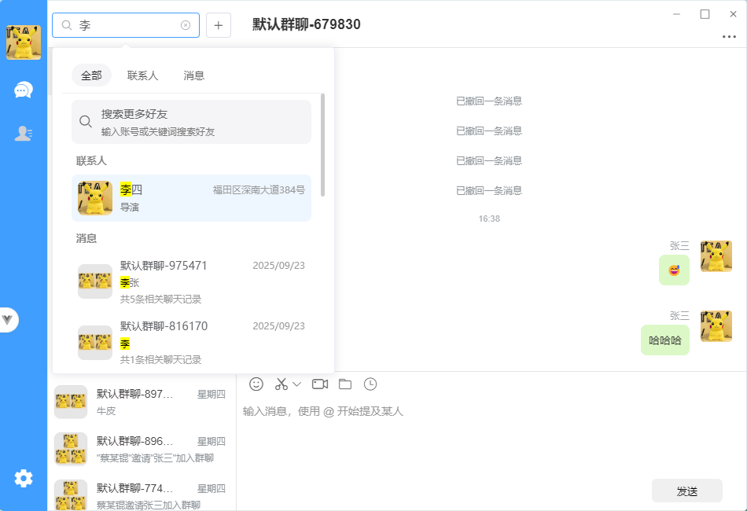
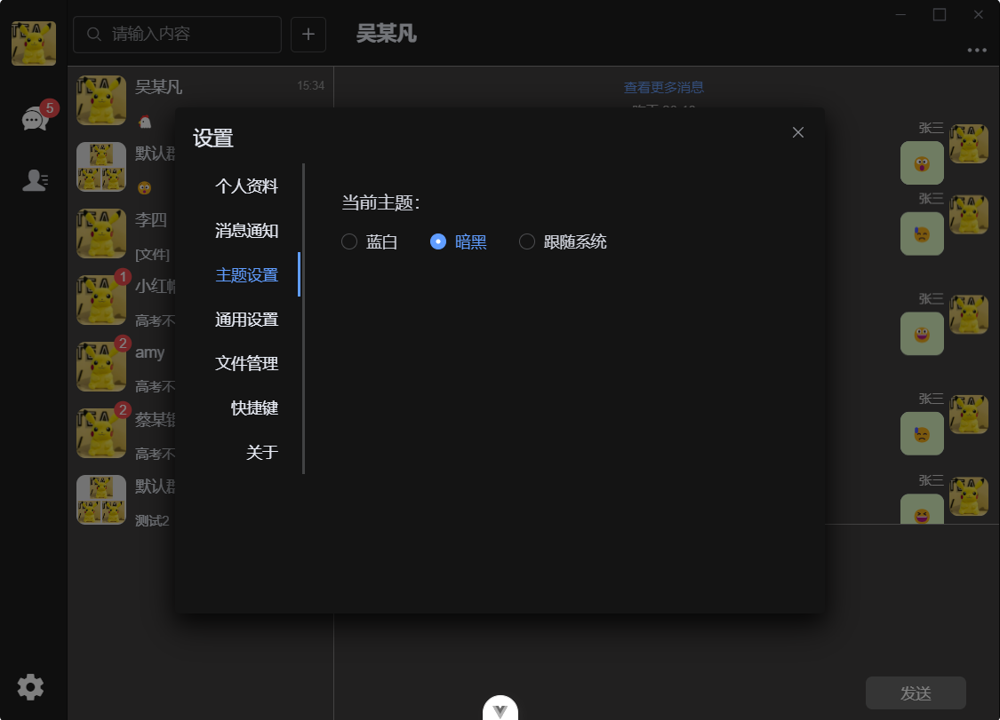
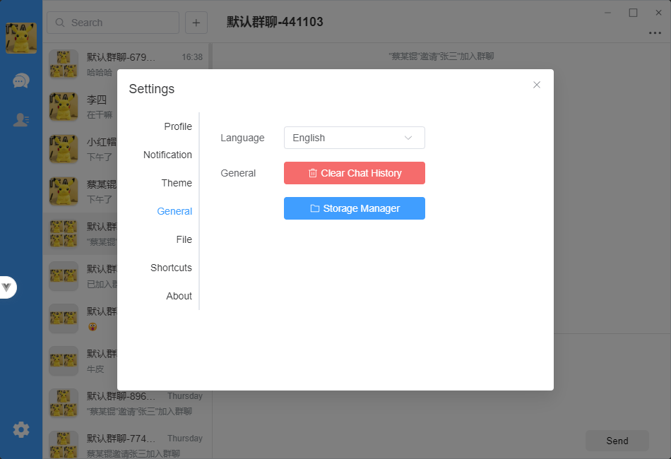
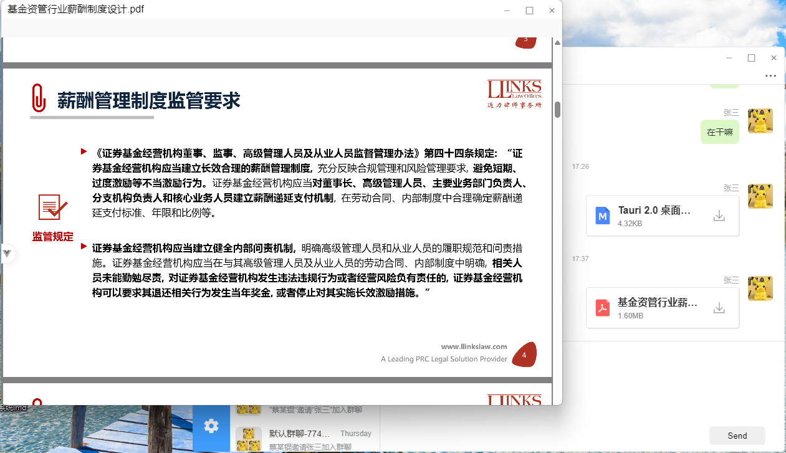

# 🍀  Lucky （IM Client）- 高性能即时通讯客户端

一个基于 Tauri 和 Vue 3 构建的跨平台即时通讯客户端应用程序。

[](https://opensource.org/licenses/MIT)
[](https://tauri.app/)
[](https://vuejs.org/)
[](https://www.typescriptlang.org/)
[](https://tauri.app/)

## 目录

- [项目概述](#项目概述) 
- [技术栈](#技术栈) 
- [功能特性](#功能特性) 
- [项目结构](#项目结构) 
- [开发环境搭建](#开发环境搭建) 
- [运行项目](#运行项目) 
- [构建项目](#构建项目) 
- [核心模块](#核心模块) 
- [数据库设计](#数据库设计) 
- [WebSocket通信协议](#websocket通信协议) 
- [国际化支持](#国际化支持) 
- [主题和样式](#主题和样式) 
- [插件和扩展](#插件和扩展) 
- [贡献指南](#贡献指南) 
- [许可证](#许可证) 


## 🌟项目概述 

IM Client (Lucky) 是一个功能丰富的即时通讯客户端，支持一对一聊天、群聊、文件传输、音视频通话、屏幕录制、屏幕截取、扫码登录等核心功能。该项目使用现代化的前端技术栈构建，通过 Tauri 框架打包为跨平台桌面应用。

### 项目特点

- **跨平台支持** - 支持 Windows、macOS 和 Linux 操作系统
- **高性能** - 使用 Rust 后端和 Vue 3 前端，确保应用运行流畅
- **安全性** - 消息加密传输，本地数据安全存储
- **现代化UI** - 基于 Element Plus 组件库构建的美观界面
- **可扩展性** - 模块化设计，易于添加新功能

### 应用场景

- 企业内部通讯
- 团队协作沟通
- 个人即时通讯
- 远程会议和协作


## 技术栈

- ### 前端核心

  - **框架**：Vue 3（响应式 UI 的王者）
  - **构建**：Vite（闪电般快速热重载）
  - **语言**：TypeScript（严格类型检查，减少 bug）
  - **状态管理**：Pinia（简洁的状态仓库）
  - **路由**：Vue Router（无缝页面导航）
  - **UI 库**：Element Plus（优雅组件，节省开发时间）
  - **样式**：SCSS（变量化主题，易于定制）
  - **国际化**：vue-i18n（多语言无缝切换）

  ### 后端与跨平台

  - **框架**：Tauri 2.5（Rust + WebView，轻量桌面应用）
  - **语言**：Rust（安全、高性能后端逻辑）
  - **数据库**：SQLite（本地持久化，高效查询）🗄️
  - **网络**：WebSocket & HTTP（实时通信 + 文件传输）
  - **序列化**：Protobuf（高效数据序列化协议）

  ### 扩展技术

  - **音视频**：WebRTC（P2P 通话，低延迟）
  - **推送**：WebSocket（即时消息通知）
  - **截图/录屏**：Screenshots (Rust) + FFmpeg（专业音视频处理工具）
  - **分词**：Jieba（中文文本处理）


##  🖼 项目预览

### ✉️ 聊天页面




### 📺️ 视频通话


### 🎯 主题切换

 


### 🔤 多语言支持




### 📄 文件在线预览




### 📌 屏幕截取


## ✨ 功能特性 

### 核心功能

1. #### **即时通讯** 💬

   - **单聊消息**：支持文本、表情、图片、文件等多种消息类型
   - **群聊消息**：支持多人聊天，@功能，群公告等
   - **消息类型支持**：
     - 文本消息：支持富文本格式、表情、链接解析
     - 图片消息：支持多种格式，自动压缩优化，支持图片预览
     - 视频消息：支持录制和发送视频
     - 音频消息：支持语音消息录制和播放
     - 文件消息：支持任意类型文件传输；支持word 、excel、pdf、 markdown等文件预览
     - 位置消息：支持发送地理位置信息
   - **消息已读回执**：显示消息是否已被对方阅读
   - **消息撤回**：支持撤回已发送的消息（时间限制内）
   - **消息转发**：支持转发消息给其他联系人或群组

2. #### **联系人管理** 👥

   - **好友列表**：展示所有好友，支持分组管理
   - **群组列表**：展示所有加入的群组，支持群组信息查看
   - **联系人搜索**：支持按姓名、ID等条件搜索联系人
   - **好友请求处理**：支持发送和处理好友请求
   - **联系人信息**：展示联系人详细信息，支持备注设置

3. #### **音视频通话** 📞

   - **一对一音视频通话**：支持高质量音视频通话
   - **群组音视频通话**：支持多人音视频会议
   - **屏幕共享**：支持共享屏幕内容
   - **噪音抑制**：内置噪音抑制功能，提升通话质量
   - **录制功能**：支持通话录制（需用户授权）

4. #### **文件传输** 📁

   - **文件上传下载**：支持大文件分片传输
   - **文件预览**：
     - PDF文件：内置PDF阅读器
     - Word文档：支持.doc/.docx格式预览
     - Excel表格：支持.xls/.xlsx格式预览
     - Markdown文档： 支持.md格式预览
   - **图片预览**：支持常见图片格式预览和缩放
   - **文件自动下载**：根据设置自动下载接收的文件
   - **文件管理**：支持查看和管理已接收文件

5. #### **系统功能** ⚙️

   - **多语言支持 (中文/英文)** 🌍
     - 界面语言切换
     - 消息内容国际化
   - **主题切换 (浅色/深色)** 🎨
     - 跟随系统主题
     - 手动切换主题模式
   - **快捷键操作** ⌨️
     - 支持常用操作快捷键
     - 可自定义快捷键设置
   - **系统托盘集成** 📦
     - 最小化到系统托盘
     - 托盘图标状态显示
     - 托盘菜单操作
   - **系统托盘消息通知** 🔔
     - 桌面通知提醒
     - 声音提示
     - 未读消息计数
     - 托盘闪烁通知
   - **截图功能** 📸
     - 全屏截图
     - 区域截图
     - 截图编辑
   - **录屏功能** 📸
     - 全屏幕录制

### 技术特性

1. **性能优化** ⚡
   - 虚拟列表优化大量消息渲染：
   - 懒加载和图片预加载：
   - 消息缓存和数据库存储：
   - 工作线程处理耗时操作：
     - 使用 Web Workers 处理密集计算任务
2. **安全特性** 🔒
   - 消息加密传输：
   - 文件安全存储：
   - XSS 防护 (DOMPurify)：
     - 消息内容安全过滤
     - 防止恶意脚本注入
   - 权限控制：
     - 操作系统权限申请
     - 用户隐私保护
     
     

## 📁 项目结构 

```
im-client/
├── proto/                    # Protocol Buffer 定义
├── public/                   # 静态资源
├── src/                      # 前端源码
│   ├── api/                  # API 接口封装
│   │   └── index.ts          # 统一API入口，封装所有后端接口调用
│   ├── assets/               # 静态资源 (图片、样式、语言包等)
│   │   ├── i18n/             # 国际化语言包
│   │   │   ├── en-US.json    # 英文语言包
│   │   │   └── zh-CN.json    # 中文语言包
│   │   ├── iconfont/         # 字体图标
│   │   ├── json/             # JSON数据文件
│   │   └── style/            # 全局样式文件
│   │       ├── fonts/        # 字体文件
│   │       └── scss/         # SCSS样式文件
│   ├── components/           # 公共组件
│   │   ├── Bubble/           # 消息气泡组件（不同类型消息的展示）
│   │   ├── ChatDetail/       # 聊天详情组件
│   │   ├── Emoji/            # 表情选择器组件
│   │   ├── FileUpload/       # 文件上传组件
│   │   ├── Message/          # 消息容器组件
│   │   ├── Setting/          # 设置相关组件
│   │   └── ...               # 其他公共组件
│   ├── constants/            # 常量定义
│   │   ├── MessageCode.ts    # 消息状态码定义
│   │   └── index.ts          # 其他常量导出
│   ├── database/             # 数据库相关 (ORM、实体、映射器)
│   │   ├── entity/           # 数据实体定义
│   │   ├── mapper/           # 数据访问映射器
│   │   └── orm/              # 自定义ORM框架
│   ├── directive/            # Vue 指令
│   │   ├── dompurify/        # DOM安全净化指令
│   │   ├── lazy/             # 图片懒加载指令
│   │   └── ...               # 其他自定义指令
│   ├── docs/                 # 项目文档
│   │   └── RNNoise集成指南.md # 噪音抑制集成文档
│   ├── hooks/                # Vue Composition API Hooks
│   │   ├── useWebRTC.ts      # WebRTC相关Hook
│   │   ├── useWebSocketWorker.ts # WebSocket通信Hook
│   │   ├── useChatInput.ts   # 聊天输入处理Hook
│   │   └── ...               # 其他功能Hooks
│   ├── i18n/                 # 国际化配置
│   │   └── index.ts          # 国际化实例配置
│   ├── layout/               # 布局组件
│   │   ├── header/           # 头部布局
│   │   ├── main/             # 主体布局
│   │   ├── side/             # 侧边栏布局
│   │   └── index.vue         # 根布局组件
│   ├── models/               # 数据模型
│   │   └── index.ts          # 所有数据模型定义
│   ├── plugins/              # Vue 插件
│   │   ├── modules/          # 各个插件模块
│   │   └── index.ts          # 插件注册入口
│   ├── proto/                # 生成的 Protocol Buffer 代码
│   ├── router/               # 路由配置
│   │   └── index.ts          # 路由定义和配置
│   ├── store/                # 状态管理 (Pinia)
│   │   ├── modules/          # 各模块状态
│   │   ├── plugins/          # 状态管理插件
│   │   └── index.ts          # 状态管理入口
│   ├── types/                # TypeScript 类型定义
│   ├── utils/                # 工具函数
│   │   ├── Http.ts           # HTTP请求工具
│   │   ├── Storage.ts        # 本地存储工具
│   │   ├── WebRTC2.ts        # WebRTC工具
│   │   └── ...               # 其他工具函数
│   ├── views/                # 页面视图
│   │   ├── message/          # 消息页面
│   │   ├── contact/          # 联系人页面
│   │   ├── call/             # 音视频通话页面
│   │   ├── setting/          # 设置页面
│   │   └── ...               # 其他页面
│   ├── windows/              # 窗口管理
│   │   ├── main.ts           # 主窗口管理
│   │   ├── login.ts          # 登录窗口管理
│   │   └── ...               # 其他窗口管理
│   ├── worker/               # Web Workers
│   │   ├── Websocket.worker.ts # WebSocket Worker
│   │   └── ...               # 其他 Worker
│   ├── App.vue               # 根组件
│   ├── core.ts               # 核心初始化逻辑
│   └── main.ts               # 入口文件
├── src-tauri/                # Tauri 后端源码
│   ├── capabilities/         # 权限配置
│   ├── resources/            # 资源文件
│   │   └── sql/              # 数据库SQL脚本
│   ├── src/                  # Rust 源码
│   │   ├── commands.rs       # Tauri命令处理
│   │   ├── lib.rs            # 库入口
│   │   ├── main.rs           # 主程序入口
│   │   └── ...               # 其他Rust模块
│   ├── Cargo.toml            # Rust 依赖配置
│   └── tauri.conf.json       # Tauri 配置
├── index.html                # HTML 模板
├── package.json              # Node.js 项目配置
├── vite.config.ts            # Vite 配置
└── README.md                 # 项目说明文档
```


## 🔧 开发环境搭建 

### 环境要求

- Node.js >= 16.0.0 
  - 推荐使用 LTS 版本以确保稳定性
  - 使用 nvm (Node Version Manager) 管理多个 Node.js 版本

- Rust >= 1.70.0 
  - Tauri 基于 Rust 构建，需要安装 Rust 工具链
  - 使用 rustup 管理 Rust 版本

- pnpm >= 8.0.0 
  - 更快、更节省磁盘空间的包管理器
  - 相比 npm 和 yarn 有更好的性能

- Protocol Buffer Compiler (protoc) 
  - 用于生成 Protocol Buffer 代码
  - 需要安装对应平台的 protoc 工具

### 📥 安装步骤

1. **克隆项目** 
   
   ```bash
   git clone <repository-url>
   cd im-client
   ```
   
2. **安装前端依赖** 
   
   ```bash
   # 安装项目依赖
   pnpm install
   
   # 如果遇到依赖问题，可以尝试清除缓存后重新安装
   pnpm store prune
   pnpm install
   ```
   
3. **安装 Tauri CLI** 
   
   ```bash
   # 全局安装 Tauri CLI 工具
   pnpm add -g @tauri-apps/cli
   
   # 或者使用 npx 运行（推荐）
   npx tauri --version
   ```
   
4. **安装 Rust 工具链** 
   
   ```bash
   # 使用官方脚本安装 Rust
   curl --proto '=https' --tlsv1.2 -sSf https://sh.rustup.rs | sh
   
   # 安装完成后，重启终端或运行以下命令加载环境变量
   source $HOME/.cargo/env
   
   # 验证安装
   rustc --version
   cargo --version
   ```
   
5. **安装 protoc** 
   
   ```bash
   # Windows (Chocolatey)
   choco install protoc
   
   # macOS (Homebrew)
   brew install protobuf
   
   # Ubuntu/Debian
   sudo apt install protobuf-compiler
   
   # 验证安装
   protoc --version
   ```
   
6. **开发工具推荐**
   
   - VS Code: 推荐的代码编辑器
   - 插件推荐：
     - Vue Language Features (Volar)
     - TypeScript Vue Plugin (Volar)
     - Rust Analyzer
     - Tauri Language Support
     - Prettier - Code formatter
     - ESLint


## ▶️ 运行项目 

### 开发模式

```bash

# 启动开发服务器（仅前端）
pnpm dev

# 启动 Tauri 开发模式（前后端同时启动）
pnpm tauri dev

# 启动开发服务器并指定环境
pnpm dev --mode development
```

### 调试模式

```bash
# 启动带调试工具的开发服务器
pnpm dev --debug

# 启动 Tauri 开发模式并启用调试
pnpm tauri dev --debug
```

### 环境配置

项目支持多种环境配置：
- `.env`: 默认环境配置
- `.env.development`: 开发环境配置
- `.env.production`: 生产环境配置

环境变量包括：
- `VITE_API_SERVER`: 后端API服务器地址
- `VITE_API_SERVER_WS`: WebSocket服务器地址
- `VITE_APP_NAME`: 应用名称


## 🏗️ 构建项目 

### 构建前端

```bash
# 构建前端资源（开发模式）
pnpm build

# 构建前端资源（生产模式）
pnpm build --mode production
```

### 构建桌面应用

```bash
# 构建 Tauri 应用（生产版本）
pnpm tauri build

# 构建调试版本（用于测试）
pnpm tauri:build:debug

# 构建指定平台的应用
pnpm tauri build --target x86_64-pc-windows-msvc
```

### 生成 Protocol Buffer 代码

```bash
# 生成 TypeScript 的 Protocol Buffer 代码
pnpm gen:proto:ts-protos
```

### 构建产物说明

构建完成后，产物位于以下目录：
- `dist/`: 前端构建产物
- `src-tauri/target/release/`: Tauri 应用构建产物
  - Windows: `.msi` 或 `.exe` 文件
  - macOS: `.app` 或 `.dmg` 文件
  - Linux: `.AppImage` 或 `.deb` 文件


## 🧩 核心模块 

### 1. 聊天系统

聊天系统是 IM 客户端的核心模块，负责处理所有与消息相关的功能。

#### 消息类型支持
- 文本消息：支持富文本格式、表情、链接
- 图片消息：支持多种格式，自动压缩优化
- 文件消息：支持任意类型文件传输
- 音频消息：支持语音消息录制和播放
- 视频消息：支持录制和发送视频
- 系统消息：系统通知和提示信息
- 群邀请消息：群组邀请相关信息

#### 核心组件
- `src/components/Bubble/` - 各类消息气泡组件
  - `text.vue`: 文本消息气泡
  - `image.vue`: 图片消息气泡
  - `file.vue`: 文件消息气泡
  - `audio.vue`: 音频消息气泡
  - `video.vue`: 视频消息气泡
  - `system.vue`: 系统消息气泡
- `src/components/Message/` - 消息容器组件
- `src/views/message/` - 消息主界面
  - `ChatView/`: 聊天列表视图
  - `ContentView/`: 聊天内容视图

#### 关键技术实现
- 虚拟列表：处理大量消息的高效渲染
- 消息缓存：提升消息加载速度
- 实时同步：确保多设备消息同步
- 消息存储：本地数据库持久化存储

### 2. 联系人系统 

联系人系统管理用户的好友关系和群组信息。

#### 功能特性
- 好友列表管理：展示所有好友，支持分组
- 群组列表管理：展示所有加入的群组
- 联系人搜索：支持按条件搜索联系人
- 好友请求处理：发送和处理好友请求

#### 核心组件
- `src/views/contact/` - 联系人主界面
  - `ContactView/`: 联系人列表视图
  - `ContentView/`: 联系人详情视图
- `src/components/SelectContact/` - 联系人选择器
- `src/components/UserPopover/` - 用户信息弹窗

#### 数据结构
- Friends 表：存储好友信息
- Groups 表：存储群组信息
- FriendRequests 表：存储好友请求信息

### 3. 音视频通话

音视频通话模块基于 WebRTC 技术实现，提供高质量的实时通信功能。

#### 功能特性
- 一对一音视频通话：点对点实时通信
- 群组音视频通话：支持多人视频会议
- 屏幕共享：支持共享屏幕内容
- 噪音抑制：内置噪音抑制功能
- 录制功能：支持屏幕录制

#### 核心模块
- `src/views/call/` - 通话界面
  - `single.vue`: 单人通话界面
  - `group.vue`: 群组通话界面
  - `accept.vue`: 通话邀请接受界面
- `src/hooks/useWebRTC.ts` - WebRTC 相关 Hook
- `src/hooks/useNoiseSuppression.ts` - 音视频噪音抑制

#### 技术实现
- WebRTC：实现点对点实时通信
- 媒体流处理：音视频采集和播放
- 信令服务器：协调连接建立过程

### 4. 文件传输 

文件传输模块支持各种类型文件的安全传输和管理。

#### 功能特性
- 文件上传下载：支持大文件分片传输
- 文件预览：
  - PDF 文件：内置 PDF 阅读器
  - Word 文档：支持 .doc/.docx 格式预览
  - Excel 表格：支持 .xls/.xlsx 格式预览
  - MakeDown文档：支持 .md 格式预览
- 图片预览：支持常见图片格式预览和缩放
- 自动下载：根据设置自动下载接收的文件
- 文件管理：支持查看和管理已接收文件

#### 核心组件
- `src/components/Bubble/file.vue` - 文件消息气泡
- `src/components/FileUpload/` - 文件上传组件
- `src/hooks/useFileTransfer.ts` - 文件传输 Hook
- `src/views/preview/file.vue` - 文件预览界面

#### 技术实现
- 分片传输：大文件分片上传和下载
- 断点续传：支持传输中断后继续
- 进度显示：实时显示传输进度
- 文件校验：确保文件完整性

### 5. 数据库系统 

数据库系统使用 SQLite 实现本地数据存储，支持高效的数据访问和查询。

#### ORM 框架
- 自研 ORM 框架，专门针对 SQLite 优化
- FTS5 全文搜索支持，提升消息搜索性能
- 事务处理，确保数据一致性
- 实体映射，简化数据库操作

#### 数据实体
- `src/database/entity/Chats.ts` - 聊天会话
- `src/database/entity/Friends.ts` - 好友关系
- `src/database/entity/SingleMessage.ts` - 单聊消息
- `src/database/entity/GroupMessage.ts` - 群聊消息
- `src/database/entity/Groups.ts` - 群组信息

#### 核心功能
- 数据持久化：本地存储用户数据
- 查询优化：索引和查询优化
- 同步机制：与服务器数据同步
- 备份恢复：数据备份和恢复功能

### 6. 系统设置 

系统设置模块允许用户自定义应用行为和界面。

#### 设置模块
- 通用设置：基本应用设置
- 通知设置：消息通知配置
- 快捷键设置：自定义快捷键
- 存储管理：文件存储管理
- 主题设置：界面主题切换
- 个人信息：用户信息管理

#### 核心组件
- `src/views/setting/` - 设置主界面
- `src/components/Setting/` - 各类设置组件
  - `General.vue`: 通用设置
  - `Notification.vue`: 通知设置
  - `Shortcut.vue`: 快捷键设置
  - `StorageManageDialog.vue`: 存储管理
  - `Theme.vue`: 主题设置
  - `Profile.vue`: 个人信息

## 数据库设计 

IM Client 使用 SQLite 作为本地数据库，存储用户数据和消息历史。

### 核心表结构

#### Chats 表
存储聊天会话信息，包括单聊和群聊会话。

#### Friends 表
存储好友信息及相关元数据。

#### SingleMessage 表
存储单聊消息的详细信息。

#### GroupMessage 表
存储群聊消息的详细信息。

### 数据库特性

1. **全文搜索支持**
   - 使用 SQLite FTS5 扩展实现消息内容分词全文搜索  
   - 支持关键词高亮显示
   - 支持搜索结果排序

2. **事务处理**
   - 关键操作使用事务确保数据一致性
   - 支持批量操作的原子性

3. **性能优化**
   - 合理的索引设计提升查询性能
   - 分页查询避免大数据量加载
   - 缓存机制减少数据库访问


## 🌐 WebSocket通信协议 

IM Client 使用 WebSocket 实现实时消息推送和通信，使用谷歌Protobuf序列化协议

### 消息类型枚举

```typescript
const IMessageType = {
  ERROR: { code: -1, description: "信息异常" },
  LOGIN_OVER: { code: 900, description: "登录过期" },
  REFRESHTOKEN: { code: 999, description: "刷新token" },
  LOGIN: { code: 1000, description: "登陆" },
  HEART_BEAT: { code: 1001, description: "心跳" },
  FORCE_LOGOUT: { code: 1002, description: "强制下线" },
  SINGLE_MESSAGE: { code: 1003, description: "私聊消息" },
  GROUP_MESSAGE: { code: 1004, description: "群发消息" },
  VIDEO_MESSAGE: { code: 1005, description: "视频消息" },
  AUDIO_MESSAGE: { code: 1006, description: "音频通话" },
  CREATE_GROUP: { code: 1500, description: "创建群聊" },
  GROUP_INVITE: { code: 1501, description: "群聊邀请" },
  ROBOT: { code: 2000, description: "机器人" },
  PUBLIC: { code: 2001, description: "公众号" }
};
```

### 连接流程

1. **建立 WebSocket 连接**
   - 客户端连接到 WebSocket 服务器
   - 传递用户认证信息（用户ID、Token）

2. **发送登录消息 (code: 1000)**
   - 发送登录请求，包含用户凭证
   - 服务器验证用户身份

3. **开始心跳检测 (code: 1001)**
   - 定时发送心跳包保持连接
   - 检测连接状态

4. **接收和发送各类消息**
   - 实时接收新消息
   - 发送用户操作消息

### 消息格式

```json
{
  "code": 1003,
  "data": {
    "messageId": "uuid",
    "fromId": "sender_id",
    "toId": "receiver_id",
    "messageType": 1,
    "messageBody": "{\"text\":\"Hello World\"}",
    "sendTime": 1640995200000
  }
}
```

### 连接管理

- 自动重连机制：网络断开后自动尝试重连
- 心跳检测：定期发送心跳包维持连接
- 连接状态监控：实时监控连接状态变化


## 🌍 国际化支持 

IM Client 支持多语言界面，满足国际化需求。

### 多语言实现

- `src/i18n/` - 国际化配置
- `src/assets/i18n/` - 语言包文件
- 支持中文和英文

### 语言包结构

```json
{
  "common": {
    "ok": "确定",
    "cancel": "取消"
  },
  "chat": {
    "send": "发送",
    "input_placeholder": "请输入消息..."
  }
}
```

### 实现机制

1. **语言包加载**

2. **文本替换**

3. **语言切换**


## 🎨 主题和样式 

IM Client 支持浅色和深色主题，提供良好的用户体验。

### 样式架构

- `src/assets/style/` - 全局样式文件
- `src/assets/style/scss/` - SCSS 样式
- `src/assets/style/theme.scss` - 主题变量

### 主题切换

- 支持浅色和深色主题
- 通过 CSS 变量实现主题切换
- `src/hooks/useThemeColor.ts` - 主题管理 Hook

### 实现机制

1. **CSS 变量**
   - 使用 CSS 自定义属性定义主题颜色
   - 通过修改变量值切换主题

2. **样式隔离**
   - 使用 SCSS 模块化管理样式
   - 避免样式冲突

3. **动态切换**
   - 支持运行时切换主题
   - 记住用户主题偏好设置

## 🔌插件和扩展 

IM Client 使用多种插件扩展功能。

### Vue 插件

- `src/plugins/modules/element.ts` - Element Plus 配置
- `src/plugins/modules/router.ts` - 路由配置
- `src/plugins/modules/store.ts` - 状态管理配置

### Tauri 插件

- `@tauri-apps/plugin-dialog` - 对话框
  - 文件选择对话框
  - 消息提示对话框
- `@tauri-apps/plugin-fs` - 文件系统
  - 本地文件读写
  - 目录操作
- `@tauri-apps/plugin-http` - HTTP 请求
  - 发起 HTTP 请求
  - 文件下载
- `@tauri-apps/plugin-sql` - 数据库操作
  - SQLite 数据库访问
  - 查询和更新操作
- `@tauri-apps/plugin-store` - 本地存储
  - 键值对存储
  - 配置信息持久化
- `@tauri-apps/plugin-websocket` - WebSocket 连接
  - WebSocket 客户端
  - 实时通信支持

## 🤝 贡献指南 

我们欢迎任何形式的贡献，包括但不限于代码提交、问题报告、文档改进等。

### 开发流程

1. Fork 项目 🍴
   - 在 GitHub 上 Fork 本项目
   - 克隆到本地开发环境

2. 创建功能分支 🌿
   - 为每个功能或修复创建独立分支
   - 分支命名规范：`feature/功能名称` 或 `fix/问题描述`

3. 提交代码更改 📥
   - 遵循代码规范和提交规范
   - 添加必要的测试用例
   - 更新相关文档

4. 发起 Pull Request 🔄
   - 提交 PR 到主仓库
   - 详细描述变更内容
   - 等待代码审查

### 代码规范

- 遵循项目现有的代码风格
- 添加必要的注释和文档
- 确保通过所有测试
- 使用 TypeScript 进行类型检查

### 提交规范

- 使用有意义的提交信息
- 遵循 conventional commits 规范
- 每个提交应该只包含一个功能或修复

### 开发工具

- 使用 VS Code 进行开发
- 安装推荐的插件
- 使用 ESLint 和 Prettier 保持代码风格一致

## ❓ 常见问题 

### 构建问题

1. 确保 Rust 工具链正确安装
   - 运行 `rustc --version` 验证
   - 如果未安装，参考安装步骤

2. 检查 Tauri 依赖是否完整
   - 查看 `src-tauri/Cargo.toml` 依赖配置
   - 运行 `cargo check` 检查依赖问题

3. 确认 protoc 编译器可用
   - 运行 `protoc --version` 验证
   - 如果未安装，参考安装步骤

### 运行问题

1. 检查环境变量配置
   - 确认 `.env` 文件配置正确
   - 检查 API 服务器地址是否可访问

2. 确认网络连接正常
   - 检查防火墙设置
   - 确认 WebSocket 服务器可访问

3. 验证数据库权限
   - 检查 SQLite 文件读写权限
   - 确认数据库文件路径正确

### 视频反向代理（nginx）Q&A

**为什么WebRTC视频通话必须使用HTTPS或localhost？**

 这是浏览器的安全策略要求。WebRTC API只能在安全上下文中使用，包括：

- 通过HTTPS提供的页面
- localhost域名（用于开发环境）
- 127.0.0.1等回环地址

这是为了防止恶意网站通过WebRTC获取用户摄像头、麦克风等敏感设备权限。

**nginx配置中各部分的作用是什么？**

- `listen 9000`：提供HTTPS信令服务，处理WebRTC连接的信令交换
- `listen 1980`：提供HTTP流媒体服务，处理视频流的传输
- `/api/` 路径：访问SRS服务器的管理API接口
- `/rtc/` 路径：处理WebRTC连接请求和信令交换
- `/.+/.*\.(flv|m3u8|ts|aac|mp3)$` 路径：处理流媒体文件的传输

**配置中的IP地址 `192.168.31.166` 需要修改吗？**

 是的，这是一个示例IP地址，您需要将其修改为实际部署SRS媒体服务器的服务器IP地址。

**如何测试反向代理配置是否正确？**

1. 启动nginx服务和SRS服务器
2. 使用浏览器访问 `https://localhost:9000` 检查信令服务是否可访问
3. 访问 `http://localhost:1980/api/v1/clients` 检查API接口是否正常
4. 尝试建立视频通话连接，确认媒体流是否正常传输

````nginx
#user  nobody;

worker_processes  1;

#pid        logs/nginx.pid;

events {
    worker_connections  1024;
}
http {
    include       mime.types;
    default_type  application/octet-stream;
    sendfile      on;
    keepalive_timeout  65;
    
	server {
        # HTTPS 监听端口（默认 443 也可以自定义，如 9191）
        listen 9000;
        server_name  localhost;  # 修改为你的域名或 IP
		
        location / {
           proxy_pass http://192.168.31.166:9000;
		   proxy_http_version 1.1;
           proxy_set_header Host $host;
           proxy_set_header X-Real-IP $remote_addr;
        }
	}

	server {
        # HTTPS 监听端口（默认 443 也可以自定义，如 9191）
        listen 1980;
        server_name  localhost;  # 修改为你的域名或 IP

        location / {
           proxy_pass http://192.168.31.166:8080/;
		   proxy_http_version 1.1;
           proxy_set_header Host $host;
           proxy_set_header X-Real-IP $remote_addr;
        }

        location ~ /.+/.*\.(flv|m3u8|ts|aac|mp3)$ {
           proxy_pass http://192.168.31.166:8080$request_uri;
		   proxy_http_version 1.1;
           proxy_set_header Host $host;
           proxy_set_header X-Real-IP $remote_addr;
        }
   
        location /api/ {
           proxy_pass http://192.168.31.166:1985/api/;
		   proxy_http_version 1.1;
           proxy_set_header Host $host;
           proxy_set_header X-Real-IP $remote_addr;
        }
        
        location /rtc/ {
           proxy_pass http://192.168.31.166:1985/rtc/;
		   proxy_http_version 1.1;
           proxy_set_header Host $host;
           proxy_set_header X-Real-IP $remote_addr;
        }
    } 	
}
````


## 🤝 贡献指南

我们欢迎所有形式的贡献！请查看 [CONTRIBUTING.md](CONTRIBUTING.md) 了解详情。

### 贡献方式

1. **Fork** 项目
2. 创建功能分支 (`git checkout -b feature/AmazingFeature`)
3. 提交更改 (`git commit -m 'Add some AmazingFeature'`)
4. 推送到分支 (`git push origin feature/AmazingFeature`)
5. 创建 **Pull Request**

### 开发交流

- 提交 Issue 报告问题或建议新功能
- 加入技术交流群讨论技术细节

## 📞 联系我们

- **项目主页**: [https://github.com/Luckly-XYZ](https://github.com/dennis9486/Lynk)
- **问题反馈**: [Issues](https://github.com/Luckly-XYZ/Lucky-client/issues)
- **邮箱**: 382192293@qq.com

## 💬 项目状态

本项目目前处于积极维护状态，持续更新和完善功能。

---

## 📢 免责声明

本项目仅供学习和参考使用，不得用于任何商业用途。作者不对使用本项目可能引起的任何直接或间接损失承担责任。

1. 本项目是一个开源学习项目，旨在提供即时通讯技术的学习和研究参考。
2. 项目中涉及的技术方案、代码实现仅供参考，不保证其在生产环境中的稳定性、安全性和可靠性。
3. 用户在使用本项目时应自行承担所有风险，包括但不限于数据丢失、系统损坏、通信安全等问题。
4. 作者不提供任何形式的技术支持和保障，也不对项目的使用效果做任何承诺和保证。
5. 如将本项目用于商业用途，需自行承担可能的法律风险和责任。

---

⭐ 如果这个项目对您有帮助，请给我们一个星标！